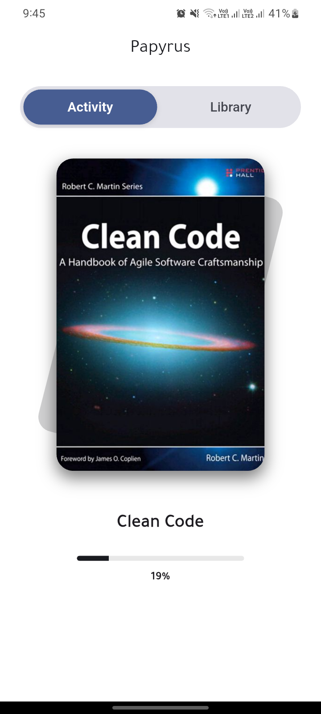
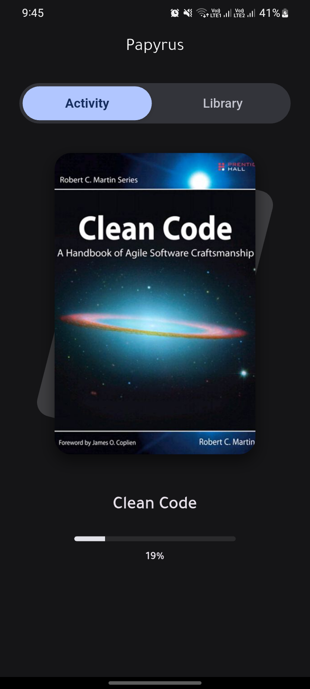

# Papyrus

A polished Native Flutter application designed as your personal pocket library. Papyrus leverages Clean Architecture and modern state management to provide a seamless reading experience, allowing users to import, organize, and read books in PDF and EPUB formats.

# Preview

Light Mode             |  Dark Mode
:-------------------------:|:-------------------------:
  |  

## Technolgy used:

- Flutter & Dart
- Clean Architecture (Data, Domain, Presentation layers)
- Feature-Driven Architecture
- State Management: flutter_bloc (Cubit & Bloc)
- Dependency Injection: get_it & injectable
- Local Database: drift (Reactive SQL persistence)
- Rendering Engines: pdfrx (High-performance PDF) & epub_plus
- UI Toolkit: Material 3 & google_fonts

## Architecture
This project strictly follows Clean Architecture principles to ensure scalability, testability, and maintainability:
- Presentation Layer: Contains UI Widgets and Cubits for state management.
- Domain Layer: Pure Dart code containing Entities, Use Cases, and Repository Interfaces.
- Data Layer: implementation of Repositories and Data Sources (Drift Database).

## Find a bug?
If you found an issue or would like to submit an improvement to this project, please submit an issue using the issue tab above. If you would like to submit a PR with a fix, reference the issue you created!

## License

The patches published as part of the Travel Buddy project are released under [GNU GPL v3](./LICENSE.txt).
